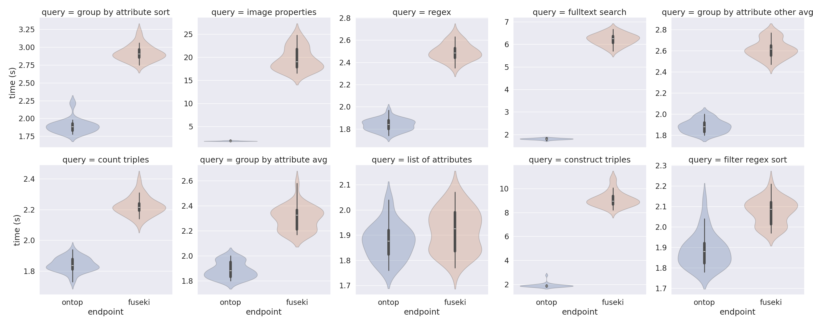

# Testing all queries from remote via vpn
- Servers: ontop, fuseki
- number of query repeats: 30
- client ip: 128.176.254.12
- client hostname: micropop046
- client software: apache-jena-5.2.0/bin/rsparql
- rsparql version reported as 4.2.0
- connection: vpn to uni-muenster
- note: all queries were run once about 30min before. Noting reduced query time on the 00-construct and other queries. Caching?

## Results

