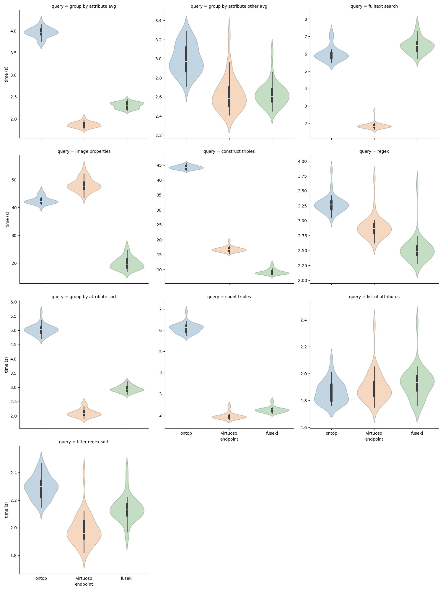

# Run 3: Same logic as Run 2 but including virtuoso
In the meantime, the virtuoso server has come online: http://10.14.28.137:8890/sparql


## Run parameters
- Servers: ontop, fuseki, virtuoso
- number of query repeats: 30
- client ip: 128.176.254.12
- client hostname: micropop046
- client software: apache-jena-5.2.0/bin/rsparql
- rsparql version reported as 4.2.0
- connection: vpn to uni-muenster
- data generating script: `run_all_queries.sh`

## Script

```
#! /bin/bash

for query in ??-*.rq; do
    echo "Wall (s),User (s),Sys (s)" > $(basename ${query} .rq).ontop.timings.collected.csv
    echo "Wall (s),User (s),Sys (s)" > $(basename ${query} .rq).fuseki.timings.collected.csv
    echo "Wall (s),User (s),Sys (s)" > $(basename ${query} .rq).virtuoso.timings.collected.csv
done

for round in {1..30}; do
    echo "round=$round "
    for query in ??-*.rq; do
        echo "$query "

        echo ontop
        ./timer.sh $query http://10.14.28.137:8080/sparql ontop 1
        cat $(basename ${query} .rq).ontop.timings.csv | tail -1 >> $(basename ${query} .rq).ontop.timings.collected.csv

        echo fuseki
        ./timer.sh $query http://10.14.28.137:3030/OME/sparql fuseki 1
        cat $(basename ${query} .rq).fuseki.timings.csv | tail -1 >> $(basename ${query} .rq).fuseki.timings.collected.csv

        echo virtuoso
        ./timer.sh $query http://10.14.28.137:8890/sparql virtuoso 1
        cat $(basename ${query} .rq).virtuoso.timings.csv | tail -1 >> $(basename ${query} .rq).virtuoso.timings.collected.csv

    done
done
```


## Results

